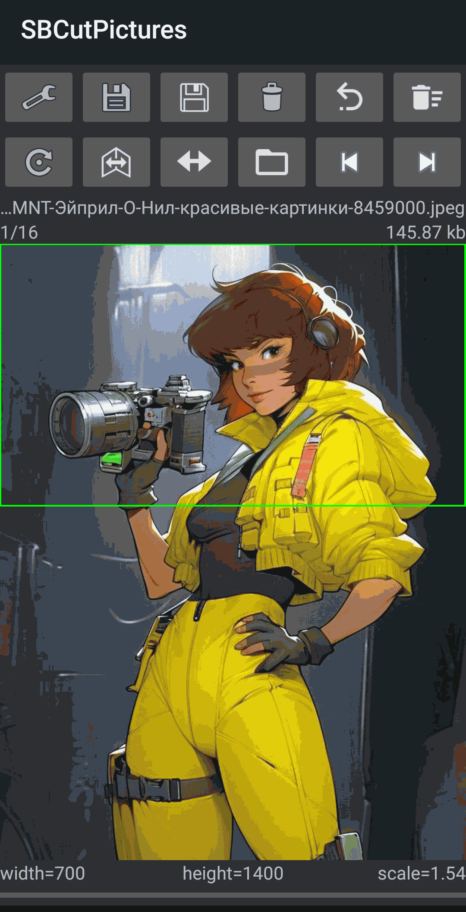
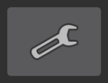
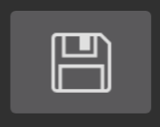
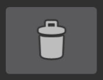
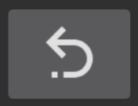
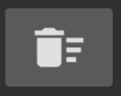
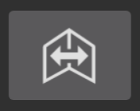
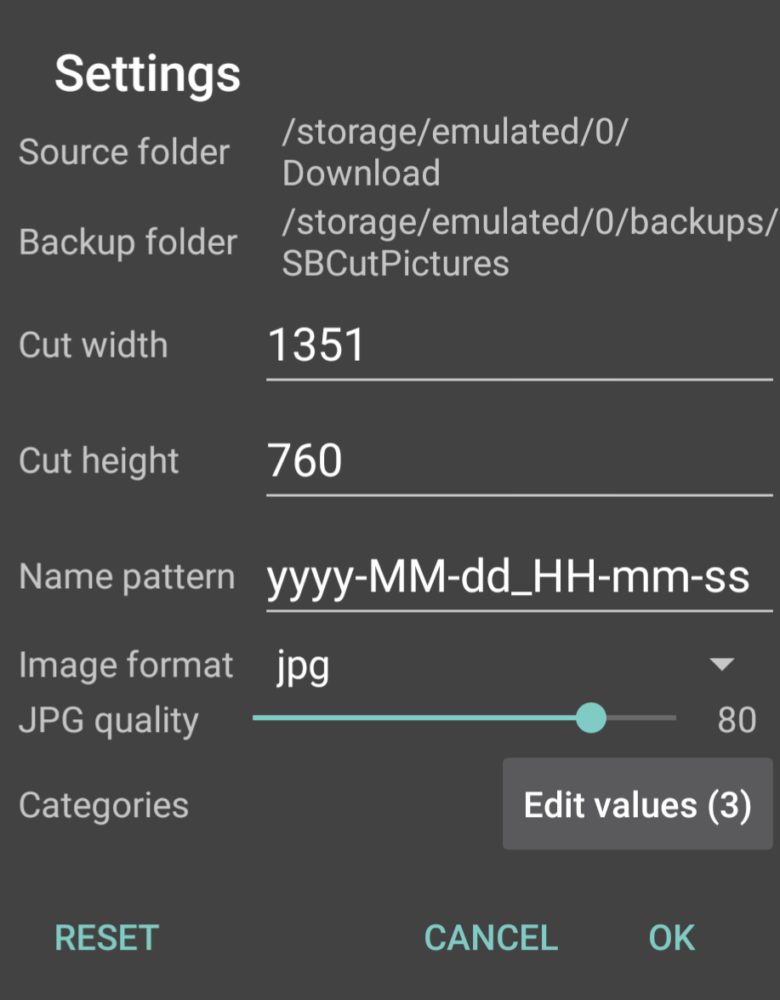
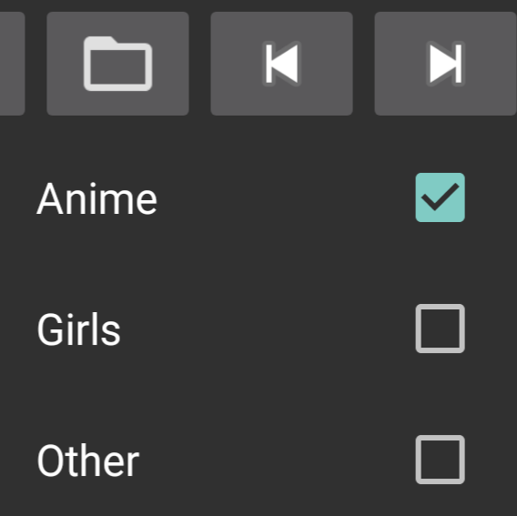

SBCutPictures

Cut pictures in some folder one by one

- Main activity

  

- Buttons
  -   settings
  -   save
  -   save as
  -   delete with backup
  -   restore last saved from backup
  -   cleanup backup
  -   rotate
  -   mirror
  -   fit to width
  -   category
  -   previous
  -   next

- Settings

  

- Categories - subfolder in source folder after save

  
